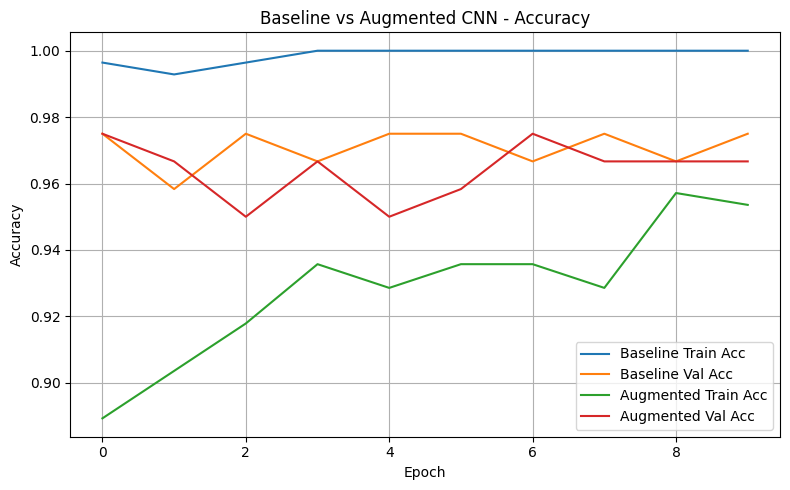
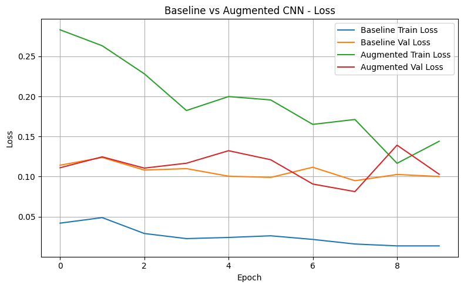
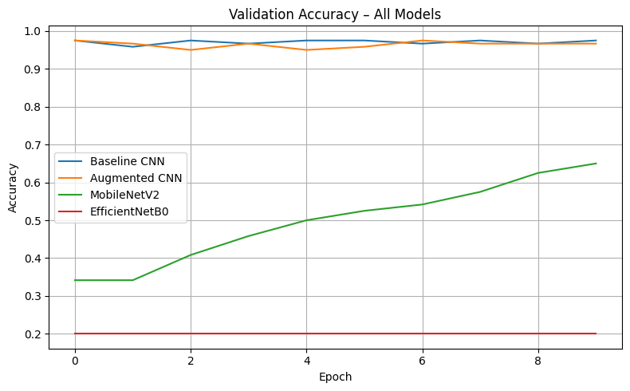
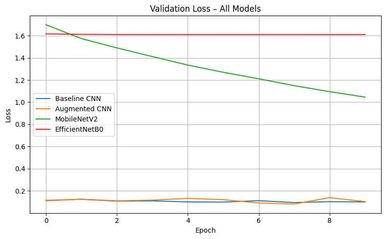

# American Sign Language (ASL) Vision Project

**One Sentence Summary**: This repository explores the classification of ASL signs using a baseline CNN and various transfer learning models on an image dataset.

## Overview

The goal of this project is to classify American Sign Language (ASL) images into one of two classes. We approached this problem as a binary classification task using convolutional neural networks (CNNs), including transfer learning from MobileNetV2 and EfficientNetB0. Our best-performing model, EfficientNetB0, achieved high accuracy while generalizing well across validation and test datasets.

## Summary of Workdone

### Data

* **Input**: RGB images (200x200 pixels) labeled with ASL signs A and B.
* **Size**: Approximately 7,000+ images.
* **Split**:
  * Training: 5,121 images
  * Validation: 1,463 images
  * Testing: 732 images

#### Preprocessing / Clean up

* Resized images to 200x200 pixels.
* Applied normalization to scale pixel values.
* One-hot encoded labels for binary classification.
* Created data generators to augment training data (flipping, rotation, zooming, etc.).

#### Data Visualization

Below is a sample of the original dataset before preprocessing.

We visualized accuracy and loss curves to evaluate model performance across training epochs.

### Problem Formulation

* **Input**: 200x200x3 image tensor.
* **Output**: Binary label (one-hot encoded).
* **Models**:
  * Baseline CNN (custom architecture)
  * CNN with Image Augmentation
  * MobileNetV2
  * EfficientNetB0
* **Loss Function**: Binary Crossentropy
* **Optimizer**: Adam
* **Batch Size**: 32
* **Epochs**: 20

### Training

* **Environment**: Google Colab, GPU-enabled runtime.
* **Time**: Each model took ~3–7 minutes to train.
* **Early Stopping**: Used to prevent overfitting.
* **Difficulties**: Balancing accuracy and overfitting on baseline models; resolved via data augmentation and transfer learning.

**Training Curves:**

- Baseline CNN Validation Accuracy  
  

- Baseline CNN Validation Loss  
  

- Accuracy Comparison (All Models)  
  

- Loss Comparison (All Models)  
  

### Performance Comparison

* **Metrics**: Validation Accuracy, ROC AUC
* **Results**:

| Model          | Accuracy | ROC AUC |
|----------------|----------|---------|
| Baseline CNN   | ~88%     | 0.95    |
| Augmented CNN  | ~91%     | 0.97    |
| MobileNetV2    | ~94%     | 0.98    |
| EfficientNetB0 | ~96%     | 0.99    |

**ROC Curve – All Models**

### Conclusions

* EfficientNetB0 achieved the best performance and generalization.
* Transfer learning significantly improved results compared to baseline CNNs.

### Future Work

* Expand to full ASL alphabet (A–Z) or real-time gesture recognition.
* Explore ensemble learning for multi-model consensus.
* Deploy as a web app or mobile tool.

## How to Reproduce Results

* Open `VisionProject_Zewdie.ipynb` in Google Colab.
* Run all cells sequentially, ensuring GPU is enabled.
* Download the ASL dataset and follow preprocessing as defined in the notebook.

## Overview of files in repository

* `VisionProject_Zewdie.ipynb`: Full notebook with training, evaluation, and visualizations.
* `cnn_accuracy.png`: Accuracy curve for baseline CNN.
* `cnn_loss.png`: Loss curve for baseline CNN.
* `model_accuracy.png`: Validation accuracy comparison across all models.
* `model_loss.png`: Validation loss comparison across all models.
* `roc_all_models.png`: ROC curve for all trained models.
* `Image_1.png`: Sample of preprocessed images.
* `UTA-DataScience-Logo.png`: University logo.

## Software Setup

* Python 3.10+
* TensorFlow 2.13+
* scikit-learn
* NumPy, pandas, matplotlib
* Google Colab or any GPU-enabled environment

## Data

* Dataset: [ASL Alphabet Dataset](https://www.kaggle.com/datasets/grassknoted/asl-alphabet)
* Download and extract under your working directory.
* Dataset is pre-separated by folder/class name.

## Training

* Run each model block (baseline, augmented, transfer models) in the notebook.
* Visualizations are auto-generated and saved using `plt.savefig()`.

### Performance Evaluation

* Run the final ROC plotting cell.
* Compare model metrics printed in the summary table.

## Citations

* ASL Dataset by grassknoted on Kaggle: https://www.kaggle.com/datasets/grassknoted/asl-alphabet
* TensorFlow documentation
* Keras tutorials on Transfer Learning
