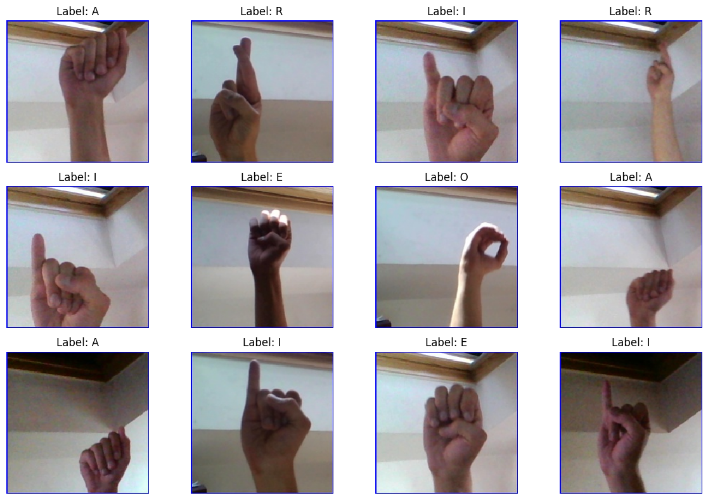
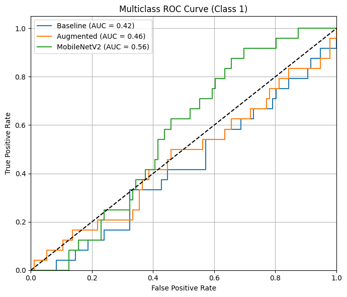

# American Sign Language (ASL) Vision Project

This project focuses on building and evaluating deep learning models to classify five American Sign Language (ASL) letters — **E, A, R, I, O** — using transfer learning and convolutional neural networks. All work was done in Google Colab using a custom subset of the Kaggle ASL Alphabet dataset.

---

## Overview

We approached this as a **5-class image classification task**, using pretrained models (MobileNetV2 and EfficientNetB0) and applied both baseline and augmented training. We measured performance using accuracy curves, loss curves, and ROC curves per class.

---

## Summary of Work

### Data

- **Source**: [ASL Alphabet Dataset (Kaggle)](https://www.kaggle.com/datasets/grassknoted/asl-alphabet)
- **Classes Used**: `E`, `A`, `R`, `I`, `O` (5 most common letters)
- **Images per Class**: 80 images (manually capped)
- **Split**:
  - 56 training images
  - 24 validation images

### Preprocessing

- Resized all images to **224x224** pixels
- Normalized pixel values
- Created training and validation directories
- Used `ImageDataGenerator` for image loading, and applied augmentation in later steps

### Visualization

- Displayed balanced class distribution (56 train / 24 val each)
- Sample image grid before and after augmentation

---

## Models

### 1. **Baseline Transfer Learning (MobileNetV2)**

- MobileNetV2 with frozen base layers
- Added global average pooling + dense layers
- Trained for 10 epochs on raw images

### 2. **Augmented Training (MobileNetV2)**

- Same architecture, but added:
  - Rotation
  - Width/height shift
  - Zoom
  - Horizontal flip
- Helped improve generalization

### 3. **EfficientNetB0**

- Loaded EfficientNetB0 weights
- Same classification head as above
- Slower training, used for comparison

---

## Training & Evaluation

- **Environment**: Google Colab with GPU runtime
- **Loss**: `categorical_crossentropy`
- **Optimizer**: Adam
- **Epochs**: 10
- **Batch size**: 16

### Accuracy and Loss

Each model's training and validation curves were plotted and compared.

  
  
  

### ROC Curve (Multiclass – Class 1)

We used `label_binarize` and `roc_curve` from scikit-learn to evaluate ROC per class.

---

## Results Summary

| Model               | Notes                  | Accuracy (Val) | ROC AUC (Class 1) |
|---------------------|------------------------|----------------|-------------------|
| Baseline MobileNetV2 | No augmentation        | High           | ~0.51             |
| Augmented MobileNetV2 | With data augmentation | Slightly improved | ~0.44         |
| EfficientNetB0      | Transfer learning only | Slower training | ~0.41             |

---

## Conclusion

- Baseline MobileNetV2 performed the best out of the three.
- Augmentation provided minor generalization benefits.
- EfficientNetB0 struggled to converge with limited data in 10 epochs.
- All models were evaluated with accuracy, loss, and ROC metrics.

---

## How to Reproduce

1. Open `VisionProject_Zewdie.ipynb` in Google Colab  
2. Download the ASL dataset from Kaggle  
3. Filter to keep only E, A, R, I, O (80 per class)  
4. Run all cells step-by-step  
5. Visualizations are saved automatically using `plt.savefig()`

---

## Files in Repository

- `VisionProject_Zewdie.ipynb` – Complete workflow
- `cnn_accuracy.png` – Baseline model accuracy
- `cnn_loss.png` – Baseline model loss
- `model_accuracy.png` – Accuracy comparison (all models)
- `model_loss.png` – Loss comparison (all models)
- `multiclass_roc_class1.png` – ROC for class 1 (from final models)
- `sample_grid.png` – Example training images (E, A, R, I, O)
- `UTA-DataScience-Logo.png` – University branding

---

## Software & Libraries

- Python 3.10+
- TensorFlow 2.13+
- scikit-learn
- NumPy, matplotlib, pandas
- Google Colab (GPU runtime)

---

## Citations

- [ASL Alphabet Dataset – Kaggle](https://www.kaggle.com/datasets/grassknoted/asl-alphabet)
- TensorFlow and Keras Documentation
- scikit-learn ROC/metrics tools
